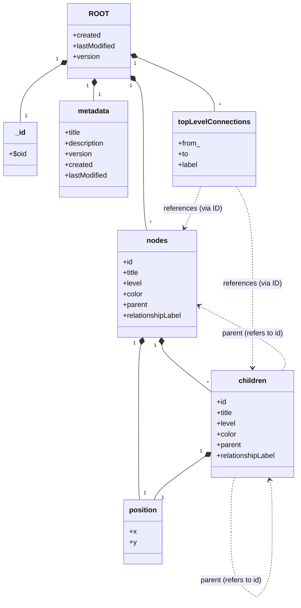
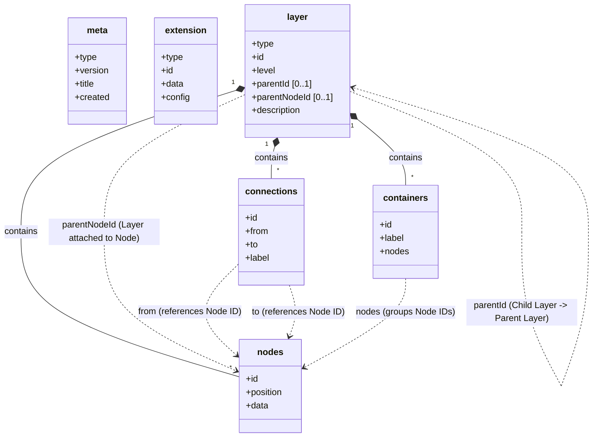

# Visualli Spec
> Version: `0.1`  
> Status: `PROPOSED`  
> Date: `22-01-2026`  

# Table of Contents
- [AS IS](#as-is)
  - [Entity Relationship Diagram](#entity-relationship-diagram)
  - [A Few Things To Think About](#a-few-things-to-think-about)
- [PROPOSED](#proposed)
  - [Key Design Elements](#key-design-elements)
  - [Entity Types](#entity-types)
  - [Entity Relationship Diagram](#proposed-entity-relationship-diagram)
  - [Example](#example)

# AS IS
> This is how AI-Engine generates Visualli data and Backend stores it.  
> Refer to `as-is.json`  

## Entity Relationship Diagram:



## A Few Things To Think About

1. **Duplicate fields**
   - `created`, `lastModified`, `version` are duplicated in `metadata` and `nodes`

2. **Relationships are defined in multiple places**
     - Recursively via the `children` array within each node.
     - Explicitly via the `topLevelConnections` array which lists all connections (`from_`, `to`, `label`).

3. **Ambiguous hierarchy**
   - The structure attempts to be both a tree (via `children`) and a graph (via `topLevelConnections`).

4. **Id uniqueness**
   - Rely on a string-based `id` 
   - Renaming or moving a node requires updating multiple references across `children`, `parent` fields, and `topLevelConnections`.
   - Unsure what is `$oid` in `_id`

5. **Recursiveness**
   - 'children' is too deeply nested to be useful (e.g. parsing and querying difficult compared to a flat list of nodes with edges) 


# PROPOSED

To address the above concerns and to support lazy loading, and flexible extensions capabilities..   

We propose a **JSONL (JSON Lines)** format, uses the **`.visualli`** file extension, where **each line represents a self-contained Entity** (`Layer` | `Extension` | `Meta`).

> Refer to `proposed-v0.1.visualli`  

## Key Design Elements

1.  **File Format**: **JSONL** (Newline Delimited JSON).
    *   **Why?** Allows streaming/chunked parsing. Each line is a complete renderable unit (a Layer).
    *   **File Extension**: Files should use the `.visualli` extension to denote Visualli data.

2.  **One Line = One Layer**:
    *   Instead of splitting nodes and connections into separate lines, they are embedded within the `layer` object.
    *   Parsing one line gives you everything needed to render that specific layer (nodes, connections, metadata).

3.  **Lazy Loading**:
    *   Layers are independent. You can fetch/stream lines and render them as they arrive.
    *   `level` attribute allows prioritizing top-level layers (0, 1) before deeper ones.

4.  **Hierarchical & Recursive**:
    *   A layer can be a child of another layer (`parentId`) and attached to a specific node (`parentNodeId`).

## Entity Types

1. Meta
Global file metadata (Line 1).
```json
{"type": "meta", "version": "2.0", "title": "Project Title", "created": "2024-05-21T10:00:00Z", "lastModified": "2024-05-22T15:30:00Z"}
```

2. Extensions (Optional)
Modular feature flags for enrichment and value adds. Multiple extensions can be defined, each on its own line (Line 2 onwards).

**Example 1: Semantic Anchors**
```json
{
  "type": "extension",
  "id": "semantic-anchors",
  "data": [
    {
      "word": "Title",
      "description": "The name of the node",
      "knowMoreUrl": "https://example.com/more"
    }
  ]
}
```

**Example 2: Particle Trails**
```json
{
  "type": "extension",
  "id": "particle-trails",
  "config": {
    "intensity": 0.8,
    "color": "blue"
  }
}
```

3. Layer
A complete renderable unit containing nodes and connections.
```json
{
  "type": "layer",
  "id": "550e8400-e29b-41d4-a716-446655440000",
  "level": 1,
  "parentId": "parent_layer_uuid",
  "parentNodeId": "parent_node_uuid",
  "description": "Layer Description",
  "nodes": [
    {
      "id": "7b63f590-5942-4214-8c88-661743048560",
      "position": {"x": 0, "y": 0},
      "data": {
        "title": "Node Title",
        "color": "#HEX"
      }
    },
    ...
  ],
  "containers": [
    {
        "id": "container_id",
        "label": "Container Label",
        "nodes": ["node_uuid_1", "node_uuid_2"]
    }
  ],
  "connections": [
    {
      "id": "f47ac10b-58cc-4372-a567-0e02b2c3d479",
      "from": "7b63f590-5942-4214-8c88-661743048560",
      "to": "another_node_uuid",
      "label": "relationship label"
    },
    ...
  ]
}
```

## Proposed Entity Relationship Diagram



## Example

To view the live example:

- Clone the repo and run a local server (e.g., `python3 -m http.server`) in the root directory.   
- Visit `http://localhost:8000/examples/example.html`.
- Modify `example.visualli` and refresh the web page to see the changes.
