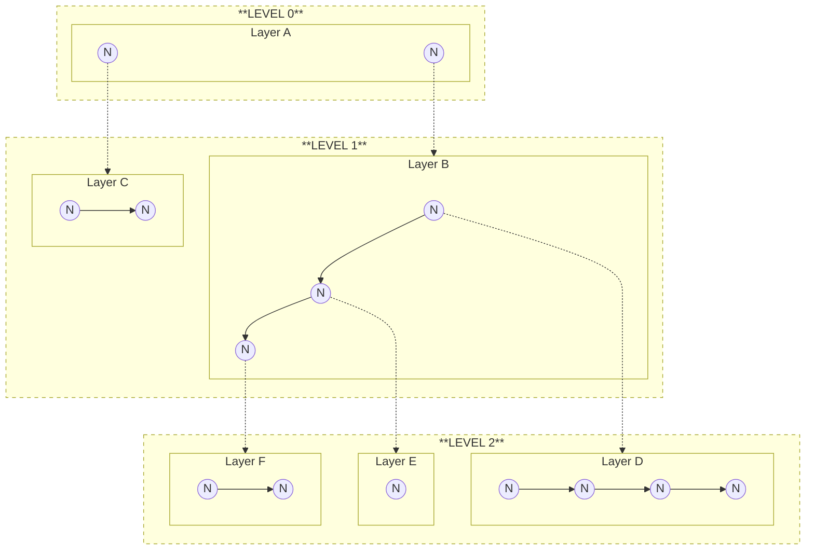

# 📖 Concepts

The core mental model of Visualli. The Specification page covers the exact JSONL format; this page explains *what* the pieces are and *why* they exist.

## The Infinite Canvas

Visualli treats information as living on an infinite 2D canvas. Content is not forced into a rigid tree — positions are free-form, but hierarchical relationships between layers and nodes are always preserved.

## Layers and Levels

### Layers

The fundamental unit of organization is the **Layer**. A layer is a self-contained collection of nodes, connections, and containers:

- **Self-contained.** Everything a layer needs to render its content lives inside it.
- **Independent.** Layers can be loaded, shown, or hidden individually — enabling "detail on demand": show the summary first, fetch deeper layers only as the user zooms or expands.
- **Hierarchical.** A layer can be a child of another layer, attached to a specific node in the parent layer.

### Levels

Multiple layers can sit at the same **Level**. Think of a level as a "floor" in a building:

- **Depth.** Level 0 is the root summary, Level 1 is the next drill-down, and so on.
- **Grouping.** Several independent layers can share one level; the user switches between them (like apartments on one floor), but only one is visible at a time.
- **Navigation.** Users progress from lower levels (overview) to higher levels (detail).

### How Layers and Levels relate



## Entities (mental model)

These are the building blocks. See the Specification page for exact JSONL fields and validation rules.

| Entity | What it represents | Key properties |
|---|---|---|
| **Node** | A single piece of information (an idea, a fact, a term). | ID, position `(x, y)`, payload (`label`, `summary`, `color`, …) |
| **Connection** | A directed relationship between two nodes in the same layer. | `from` → `to` node IDs, label and style (solid / dashed) |
| **Container** | A visual grouping of nodes in the same layer. | List of node IDs, label, formation (radial / linear / …), border style |
| **Extension** | An optional payload for behavior or metadata that isn't in the core schema. | String ID + free-form `data[]` — examples: semantic anchors, themes, visual effects |

### Extension example

Extensions are identified by ID, and their payload shape is up to the extension's contract. For instance, a `semantic-anchors` extension links terms to descriptions:

```json
{
  "type": "extension",
  "id": "semantic-anchors",
  "data": [
    {
      "word": "atmosphere",
      "description": "The envelope of gases surrounding the earth or another planet.",
      "knowMoreUrl": null
    },
    {
      "word": "water circulation",
      "description": "The continuous movement of water on, above and below the surface of the Earth.",
      "knowMoreUrl": null
    }
  ]
}
```
