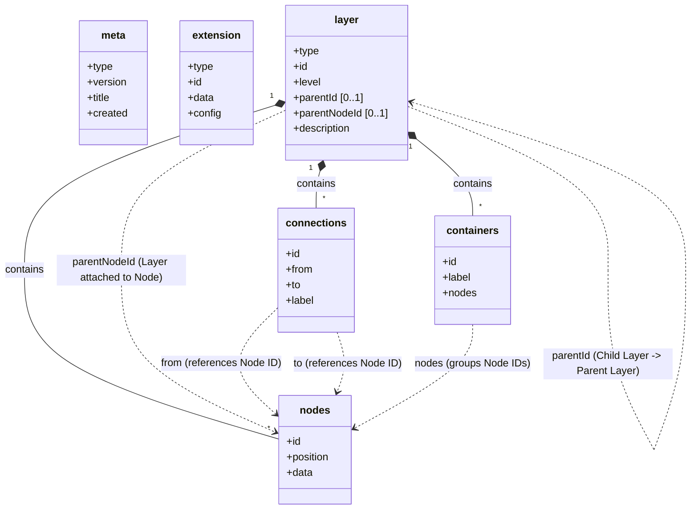

# Core Concepts

## The Infinite Canvas

Visualli treats information as existing on an infinite 2D canvas. Unlike rigid tree structures, Visualli allows for flexible positioning while maintaining strict hierarchical relationships.

## Layers

The fundamental unit of organization in Visualli is the **Layer**. 

*   **Self-Contained**: A layer contains a set of nodes and connections that belong together.
*   **Independent**: Layers can be loaded, rendered, or hidden independently.
*   **Hierarchical**: A layer can be a child of another layer, attached to a specific node in the parent layer.

This allows for "Detail on Demand". A high-level summary layer can load first, and deeper detailed layers can be fetched only when the user zooms in or expands a node.

## Entities

### Nodes
Nodes represent discrete pieces of information.
*   **Identity**: Unique ID (UUID).
*   **Data**: Payload (Title, Description, Color, etc.).
*   **Position**: (x, y) coordinates on the canvas.

### Connections
Connections represent relationships between nodes within a layer.
*   **Directional**: From Node A to Node B.
*   **Labeled**: Can carry semantic meaning (e.g., "includes", "caused by").

### Containers
Containers allow for visual grouping of related nodes within a layer.
*   **Grouping**: Contains a list of Node IDs.
*   **Labeled**: Can have a title or label (e.g., "Upward Movement").

### Extensions
Extensions provide a mechanism to add metadata or change behavior without altering the core schema. Examples include:
*   **Semantic Anchors**: Linking terms to external knowledge.
*   **Particle Trails**: Configuring visual effects like particle trails.
*   **Themes**: Configuring themes.

## Entity Relationship Diagram

The following diagram illustrates the relationships between the core entities in the Visualli specification.

