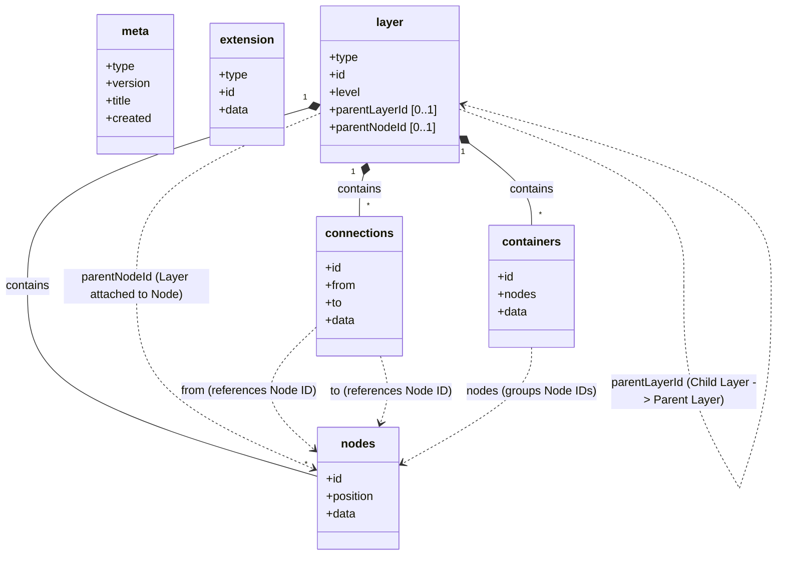

# 📐 Visualli Specification

Visualli uses **JSONL (JSON Lines)** as its primary interchange format. Each line in a `.visualli` file is a single JSON object representing exactly one entity: `Meta`, `Extension`, or `Layer`.

> **Single source of truth.** The formal validation rules are defined in [visualli.schema.json](../visualli.schema.json).
>
> **Reading the concepts first?** See [Concepts](concepts.md) for the mental model — infinite canvas, layers vs. levels, and the role of each entity.

## File Structure

A valid `.visualli` file is a sequence of JSON objects, separated by newlines (`\n`):

```
Meta        → required, exactly one, first line
Extension   → optional, zero or more, after Meta, before Layers
Layer       → required, one or more, after Meta/Extensions
```

```jsonl
{"type": "meta", ...}
{"type": "extension", ...}
{"type": "layer", ...}
{"type": "layer", ...}
```

### Minimal example

```jsonl
{"type": "meta", "version": "2.0", "title": "Example Map", "created": "2024-05-21T10:00:00Z", "lastModified": "2024-05-22T15:30:00Z"}
{"type": "layer", "id": "layer-1", "level": 0, "nodes": [{"id": "n1", "position": {"x": 0, "y": 0}, "data": {"label": "Root Node", "summary": "The starting point"}}]}
```

## Entity Relationship Diagram

How the top-level entities and their embedded components relate:



## Schema Definitions

### 1. Meta Object

Must be the **first line** of the file. Exactly one per file.

```typescript
interface Meta {
  type: "meta";
  version: string;       // e.g. "2.0"
  title: string;         // Project title
  created: string;       // ISO 8601 date
  lastModified: string;  // ISO 8601 date
}
```

### 2. Extension Object

Optional. Appears after `Meta` and before any `Layer` lines. Extensions add metadata or behavior without changes to the core schema (examples: semantic anchors, themes, visual-effects configuration).

```typescript
interface Extension {
  type: "extension";
  id: string;            // e.g. "semantic-anchors"
  data?: any[];          // Extension-specific payload
}
```

Example — a `semantic-anchors` extension that links terms to descriptions:

```json
{
  "type": "extension",
  "id": "semantic-anchors",
  "data": [
    { "word": "atmosphere",
      "description": "The envelope of gases surrounding the earth or another planet.",
      "knowMoreUrl": null },
    { "word": "water circulation",
      "description": "The continuous movement of water on, above and below the surface of the Earth.",
      "knowMoreUrl": null }
  ]
}
```

### 3. Layer Object

The core content unit — each `Layer` line is a self-contained slice of the document.

```typescript
interface Layer {
  type: "layer";
  id: string;                       // Unique layer ID
  level: number;                    // Depth in the hierarchy (0 = root)
  parentLayerId?: string;           // Parent layer ID (absent for root layers)
  parentNodeId?: string;            // Node in the parent layer this layer attaches to
  layout?:
    | "radial"
    | "linear-horizontal"
    | "linear-vertical";
  nodes?: Node[];
  connections?: Connection[];
  containers?: Container[];
}
```

`layout` describes how nodes are positioned across the whole layer. It differs from `Container.data.formation`: layout positions *all* nodes in the layer relative to the parent node, while formation arranges only the nodes inside a specific container.

| `Layer.layout` | When to use |
|---|---|
| `radial` | Peer categories radiating from a parent node — the common default for branches with no inherent order. |
| `linear-horizontal` | Chronological sequences, timelines, ordered progressions, geographic or alphabetical flows. |
| `linear-vertical` | Priority ordering, ranked lists, ranked hierarchy, or steps in a process. |

---

### 3.1 Node Object (embedded in Layer)

A discrete unit of information, positioned at `(x, y)` on the canvas.

```typescript
interface Node {
  id: string;
  position: { x: number; y: number };
  data: {
    label: string;
    summary?: string;
    color?: string;    // any valid CSS color
  };
}
```

| Attribute | Value | When to use |
|---|---|---|
| `Node.data.color` | Any valid CSS color (`#ff0000`, `red`, `hsl(...)`) | Visually distinguish nodes by category, priority, or state. |

---

### 3.2 Connection Object (embedded in Layer)

A directed relationship between two nodes in the **same layer**.

```typescript
interface Connection {
  id: string;
  from: string;     // source Node ID
  to: string;       // target Node ID
  data: {
    label: string;
    style?: "dashed" | "solid";
  };
}
```

| `Connection.data.style` | When to use | How it looks |
|---|---|---|
| `solid` | Strong, direct, or causal relationship — clear flow or dependency. |  |
| `dashed` | Indirect or associative link — related but no direct causal chain. | *(placeholder)* |

---

### 3.3 Container Object (embedded in Layer)

A visual grouping of nodes within the same layer. It does not create hierarchy; it communicates that a set of nodes share a role or category.

```typescript
interface Container {
  id: string;
  nodes: string[];   // Node IDs being grouped
  data: {
    label: string;
    formation?:
      | "radial"
      | "linear-horizontal"
      | "linear-vertical";
    style?: "dashed" | "none";
  };
}
```

`Container.data.formation` shares its vocabulary with `Layer.layout` but has a different scope: a formation arranges nodes inside the container grouping, while a layout arranges all nodes in the layer. A container can legitimately use a different formation than its enclosing layer's layout.

| Attribute | Value | When to use | How it looks |
|---|---|---|---|
| `Container.data.formation` | `radial` | Nodes in the group radiate from a shared center; good for peer categories within the grouping. | *(placeholder)* |
| `Container.data.formation` | `linear-horizontal` | Nodes in the group are arranged along a horizontal axis; good for sequences or timelines. | *(placeholder)* |
| `Container.data.formation` | `linear-vertical` | Nodes in the group are arranged along a vertical axis; good for ranked lists or hierarchies. | *(placeholder)* |
| `Container.data.style` | `dashed` | Container boundary is drawn with a dashed stroke. |  |
| `Container.data.style` | `none` | Container boundary is hidden; grouping is logical only (used e.g. to target the group via an extension). |  |
