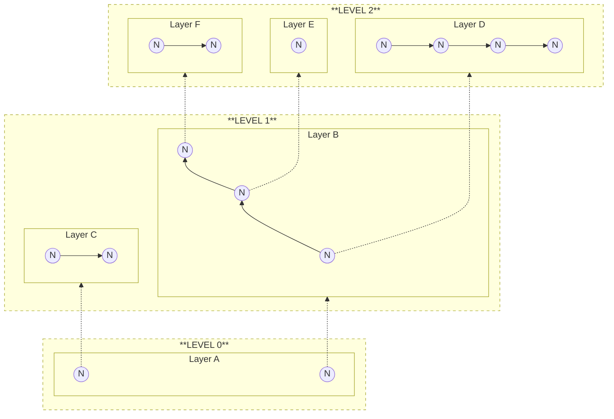
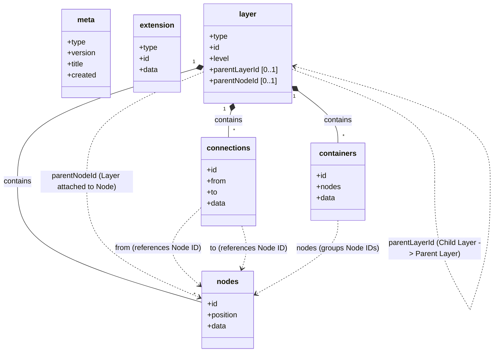
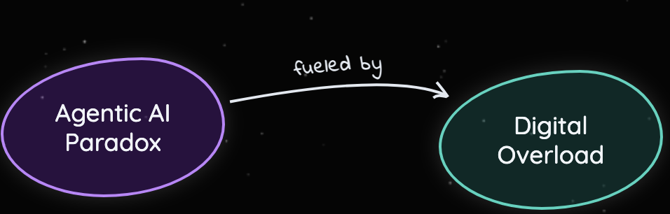
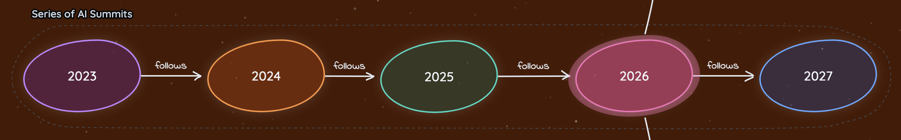
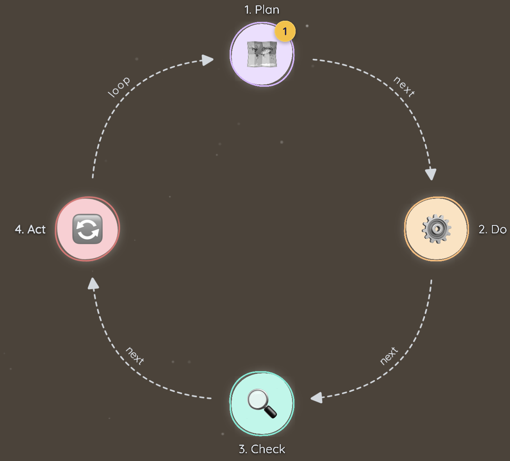
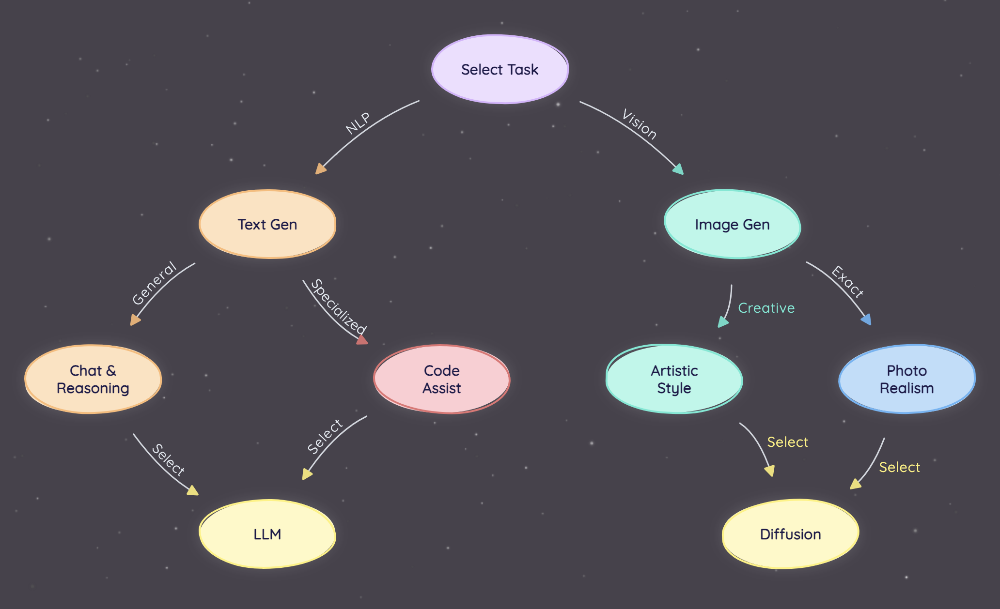
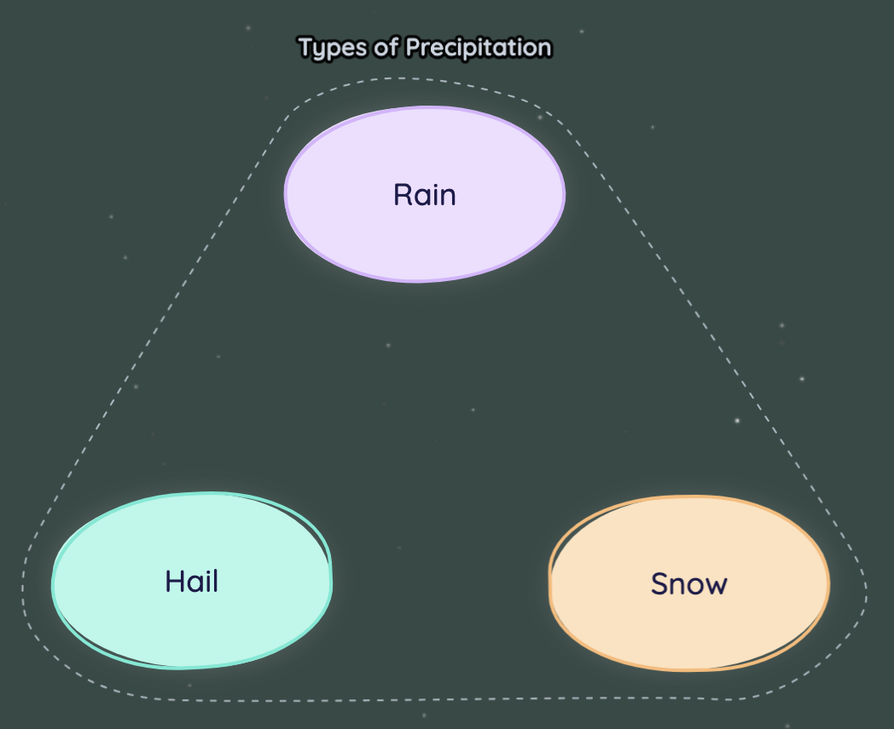
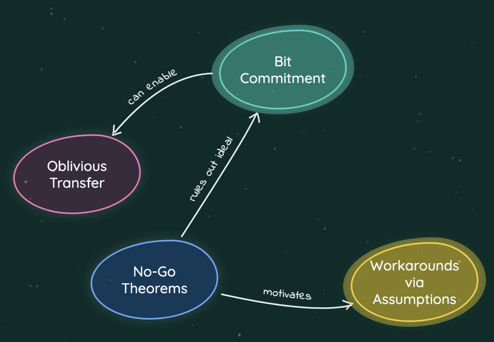

# Visualli Specification

Visualli uses **JSONL (JSON Lines)** as its primary interchange format. 
Each line in a `.visualli` file represents a distinct entity (`Meta`, `Extension`, or `Layer`).

> **Source of Truth**: The formal validation rules are defined in [visualli.schema.json](../visualli.schema.json).

## Core Concepts

### The Infinite Canvas

Visualli embraces the concept of infinite canvas, where information can be positioned flexibly anywhere in space while maintaining strict hierarchical relationships between layers and nodes. 

This approach liberates content from the constraints of rigid tree structures (like found in traditional mindmaps), allowing for organic, spatial organization that mirrors natural thought patterns. 

### Layers and Levels

#### Layers

The fundamental unit of organization in Visualli is the **Layer**. 

*   **Self-Contained**: A layer contains a set of nodes, connections, and containers that belong together.
*   **Independent**: Layers can be loaded, rendered, or hidden independently.
*   **Hierarchical**: A layer can be a child of another layer, attached to a specific node of the parent layer.

This allows for "Detail on Demand". A high-level summary layer can load first, and deeper detailed layers can be fetched only when the user zooms in or expands a node.

#### Levels

Multiple **Layers** can belong to a certain **Level**. 

*   **Depth**: Represents the depth of information in the hierarchy (Level 0, 1, 2...).
*   **Grouping**: Acts like a "floor" in a building, where multiple apartments (Layers) coexist while only one Layer is visible to the user at any given moment.
*   **Navigation**: Users start at overview levels (summary) and drill down into deeper levels (detail).

#### How Layers and Levels are connected?



## File Structure

A valid `.visualli` file consists of a sequence of JSON objects, separated by newlines (`\n`).

```jsonl
{"type": "meta", ...}
{"type": "extension", ...}
{"type": "layer", ...}
{"type": "layer", ...}
```

### Example

```jsonl
{"type": "meta", "version": "2.0", "title": "Example Map", "created": "2024-05-21T10:00:00Z", "lastModified": "2024-05-22T15:30:00Z"}
{"type": "layer", "id": "layer-1", "level": 0, "nodes": [{"id": "n1", "position": {"x":0,"y":0}, "data": {"label": "Root Node", "summary": "The starting point"}}]}
```

## Entity Relationship Diagram

The following diagram illustrates the relationships between the core entities in the Visualli specification.



## Schema Definitions

### 1. Meta Object
Must be the first line of the file.

```typescript
interface Meta {
  type: "meta";
  version: string;       // e.g., "2.0"
  title: string;         // Project Title
  created: string;       // ISO 8601 Date
  lastModified: string;  // ISO 8601 Date
}
```

### 2. Extension Object
Optional. Defines enabled extensions or configurations. Extensions provide a mechanism to add metadata or change behavior without altering the core schema. Examples include:
*   **Semantic Anchors**: Linking terms to external knowledge.
*   **Particle Trails**: Configuring visual effects like particle trails.
*   **Themes**: Configuring themes.

```typescript
interface Extension {
  type: "extension";
  id: string;            // Extension ID (e.g., "semantic-anchors")
  data?: any[];          // Extension-specific data
}
```

Example of a `semantic-anchors` extension:
```json
{
  "type": "extension",
  "id": "semantic-anchors",
  "data": [
    {
      "word": "atmosphere",
      "description": "The envelope of gases surrounding the earth or another planet.",
      "knowMoreUrl": null
    },
    {
      "word": "water circulation",
      "description": "The continuous movement of water on, above and below the surface of the Earth.",
      "knowMoreUrl": null
    }
  ]
}
```

### 3. Layer Object
The core content unit.

```typescript
interface Layer {
  type: "layer";
  id: string;            // UUID
  level: number;         // Depth level (0 = root)
  parentLayerId?: string; // UUID of parent layer (optional for root)
  parentNodeId?: string; // UUID of parent node in parent layer (optional)
  nodes?: Node[];
  connections?: Connection[];
  containers?: Container[];
}
```

#### Node Object
Nodes represent discrete pieces of information.
*   **Identity**: Unique ID (UUID).
*   **Data**: Payload (Label, Summary, Color, etc.).
*   **Position**: (x, y) coordinates on the canvas.

```typescript
interface Node {
  id: string;            // UUID
  position: { x: number; y: number };
  data: {
    label: string;       // Label text
    summary: string;     // Short description/summary
    color?: string;
  };
}
```

#### Connection Object
Connections represent relationships between nodes within a layer.
*   **Directional**: From Node A to Node B.
*   **Data**: Payload (Label, Style).

```typescript
interface Connection {
  id: string;            // UUID
  from: string;          // Source Node ID
  to: string;            // Target Node ID
  data: {
    label: string;
    style?: 'dashed' | 'solid';
  };
}
```

| Attribute | Value | When to use | How it looks |
|-----------|-------|-------------|--------------|
| Connection.data.style | `solid` | Used when nodes have a direct, causal, or strong relationship indicating clear flow or dependency. |  |
| Connection.data.style | `dashed` | Used when both nodes are indirectly related to each other, and there is no direct causal relation between both of them, yet they signify certain association. | <<image>> |


| Attribute | Value | When to use | How it looks |
|-----------|-------|-------------|--------------|
| Node.data.color | Any valid CSS color (e.g., `#ff0000`) | Used to visually distinguish nodes by category, priority, or state. | <<image>> |


#### Container Object
Containers allow for visual grouping of related nodes within a layer.
*   **Grouping**: Contains a list of Node IDs.
*   **Data**: Payload (Label, Formation, Style).

```typescript
interface Container {
  id: string;            // UUID
  nodes: string[];       // Array of Node IDs
  data: {
    label: string;       // Container Label
    formation?: 'natural' | 'linear' | 'circular' | 'tree';
    style?: 'dashed' | 'none';
  };
}
```

| Attribute | Value | When to use | How it looks |
|-----------|-------|-------------|--------------|
| Container.data.formation | `natural` | Default free-form positioning; nodes stay where placed. | <<image>> |
| Container.data.formation | `linear` | Nodes are arranged along a straight line. |  |
| Container.data.formation | `circular` | Nodes are arranged in a circle or ellipse. |  |
| Container.data.formation | `tree` | Nodes are arranged in a hierarchical tree layout. |  |
| Container.data.style | `dashed` | Container boundary is shown with a dashed stroke. |  |
| Container.data.style | `none` | Container boundary is hidden; grouping is logical only. |  |

